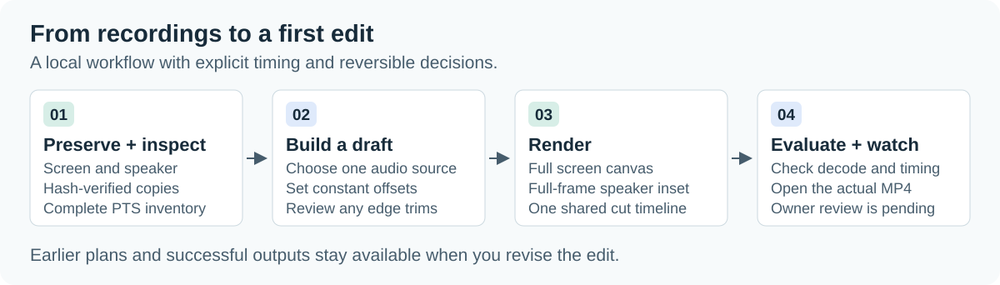

# TalkCut

Turn a screen recording and a speaker recording into a lecture video you can revise.


TalkCut is a local command-line editor. It keeps the screen recording's full
canvas, overlays the speaker's full frame in the upper-right corner, and uses
one selected audio source. Every cut follows the same measured timeline across
video and audio. Original recordings, earlier plans and successful renders stay
available when you change your mind.

**First-edit alpha.** You can compose a lecture, apply reviewed start/end trims,
and check the complete output's decode, timing and geometry. Synchronization
assumptions are explicit. Whole-lecture audiovisual certification and owner
acceptance remain separate work; automatic disfluency removal is deferred.

[Get started](docs/getting-started.md) · [Documentation](docs/README.md) ·
[CLI reference](docs/cli-reference.md) · [Contribute](CONTRIBUTING.md)

## How it works

<picture>
  <source media="(max-width: 600px)" srcset="docs/assets/workflow-mobile.svg">
  
</picture>

`init` saves hash-verified copies. `inspect` records the actual presentation
timestamps (PTS) and audio samples. A draft records your audio choice, constant
offsets and any edge trims. The plan compiles to one timeline, which the renderer
encodes into an MP4.
`draft evaluate` then rechecks the current plan and fully decodes its output.

The cover illustration is conceptual. TalkCut's interface is the CLI, and the
[architecture guide](docs/architecture.md) explains the actual artifacts and time mapping.

## Make your first edit

Install Python 3.12+, [uv](https://docs.astral.sh/uv/) and FFmpeg with ffprobe.
FFmpeg is a separate system dependency. From a checkout of this repository:

```sh
uv sync --locked --python 3.12
uv run --locked talkcut doctor --json
```

Use your own recording paths. `projects/` is ignored by Git.

```sh
uv run --locked talkcut init projects/my-lecture \
  --screen /path/to/screen.mp4 --speaker /path/to/speaker.mp4 --json
uv run --locked talkcut inspect projects/my-lecture --full-decode --json
uv run --locked talkcut status projects/my-lecture --json
```

Replace `REVISION` below with the integer returned by `status`. This first pass
keeps the whole recording and assumes both sources share a clock. For different
start times, set reviewed offsets using the [timing guide](docs/getting-started.md#3-choose-the-timing-and-build-a-draft).
Constant offsets cannot correct clock drift.

```sh
uv run --locked talkcut draft build projects/my-lecture \
  --audio-source screen --audio-offset 0 --speaker-offset 0 \
  --trim-start 0 --trim-end 0 \
  --reason "Preserve the complete recording for the first composition" \
  --expected-revision REVISION --json
uv run --locked talkcut render projects/my-lecture --profile draft --json
uv run --locked talkcut draft evaluate projects/my-lecture --json
```

Open the MP4 at `output.path` in the render response. Check the timing, speaker
placement and sound in the actual video. `DRAFT_TECHNICALLY_READY` means the
technical checks passed; audiovisual review and owner approval remain pending.
Rebuild with different reviewed edge trims to revise or restore the edit.

To try TalkCut with generated media, run the
[recovery walkthrough](docs/recovery.md), which exercises a cut and restoration
without using a personal recording.

## Choose the right workflow

| Your task | Read |
| --- | --- |
| Compose and revise a first lecture edit | [Getting started](docs/getting-started.md) |
| Find a command, flag or exit code | [CLI reference](docs/cli-reference.md) |
| Lower audio level or recover after a failed render | [Audio processing](docs/audio-processing.md) · [Recovery](docs/recovery.md) |
| Understand exact timing, stored artifacts and invalidation | [Architecture](docs/architecture.md) |
| Work through strict audiovisual review and acceptance | [Acceptance](docs/acceptance.md) · [Evidence reference](docs/evidence-reference.md) |
| Change the code or maintain the docs | [Contributing](CONTRIBUTING.md) · [Documentation guide](docs/documentation.md) |

The strict first-lecture evaluator is bound to the registered DGIST dataset and
its frozen contract. Diagnostic renders and draft technical checks cannot satisfy
that contract. [RFC 0003](docs/plans/0003-first-edit-mvp.md) defines the separately
scoped first-edit handoff; the [acceptance guide](docs/acceptance.md) distinguishes
its status from strict readiness and owner acceptance.

## Supported scope

The initial source profile is H.264, 8-bit progressive SDR, with mono or stereo
AAC. Unsupported display transforms, non-square pixels, clocks and unresolved
gaps are rejected. The renderer preserves screen presentation intervals and
handles speaker coverage boundaries explicitly. Compositing re-encodes the video.

Cloud analysis is disabled by default. No cloud SDK, paid API or automatic
provider fallback is configured. Local speech recognition alone does not provide
audiovisual review. Subtitles, chapters, slide reconstruction, a graphical editor,
podcasts and lecture publishing are outside this workflow.

Keep recordings, transcripts, review evidence and credentials in private storage;
see [SECURITY.md](SECURITY.md). TalkCut code is [MIT licensed](LICENSE).
Third-party executables, dependencies, models and recordings retain their own terms.
