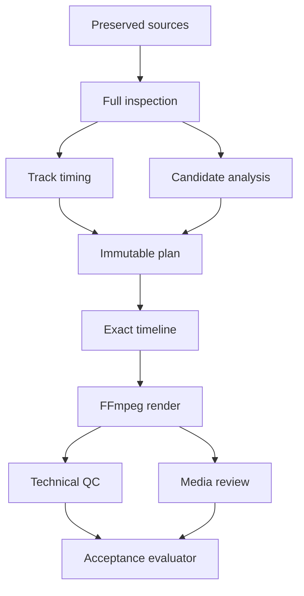
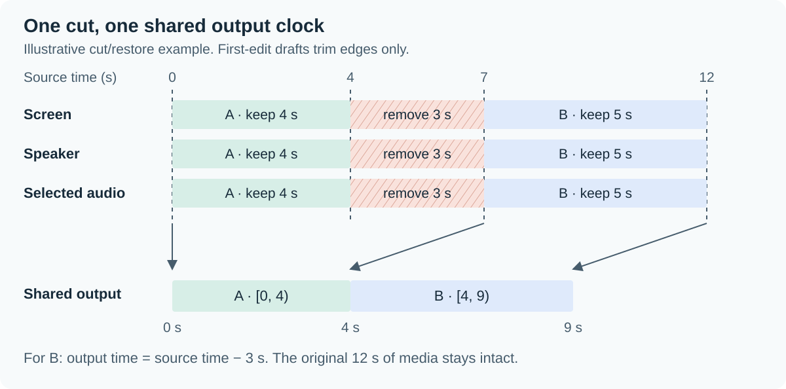
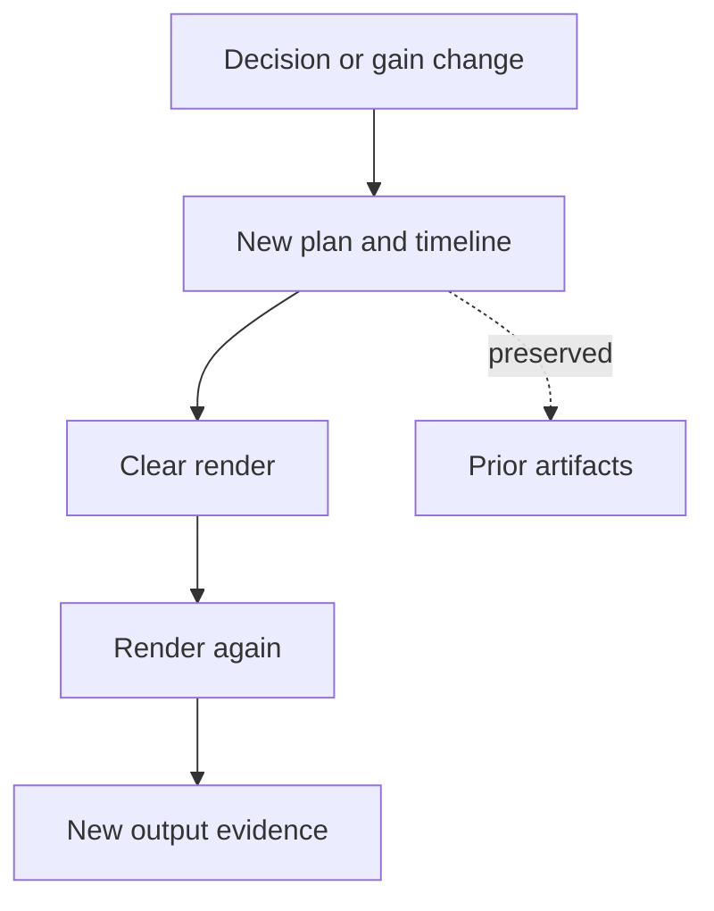

# How TalkCut works

TalkCut preserves the source recordings, describes each edit in source time, and
compiles that description into a measured video and audio schedule. Rendering and
review consume the same immutable plan. A successful encode establishes only the
checks it actually ran; readiness requires separate evidence about the content.

This guide is for contributors. For a runnable recovery exercise, see
[Reproduce a reversible edit](recovery.md). For the rationale behind individual
constraints, see [Implementation decisions](implementation-decisions.md).

## Follow an edit through the system



In the reviewed path, source synchronization and deletion decisions need their
own evidence. A diagnostic plan uses test-only assumptions. The explicit draft
path accepts declared offsets and edge trims; its technical result leaves those
synchronization assumptions and the lecture's content unverified.

| Area | Start here | Responsibility |
| --- | --- | --- |
| CLI and workflow | [`__main__.py`](../src/talkcut/__main__.py), [`workflow.py`](../src/talkcut/workflow.py) | Parse commands, connect operations, register renders and reports. |
| Project storage | [`project.py`](../src/talkcut/project.py), [`contracts.py`](../src/talkcut/contracts.py) | Preserve source bytes, validate artifacts, lock updates and commit revision history. |
| Media inspection | [`media.py`](../src/talkcut/media.py), [`geometry.py`](../src/talkcut/geometry.py) | Measure decoded frame/sample inventories, source geometry and format support. |
| Synchronization | [`sync.py`](../src/talkcut/sync.py) | Measure audio offsets and verify separately supplied source alignment evidence. |
| Editorial inputs | [`analysis.py`](../src/talkcut/analysis.py), [`context_collection.py`](../src/talkcut/context_collection.py) | Generate candidates and bind them to source context and review execution. |
| Plans and mapping | [`plan.py`](../src/talkcut/plan.py), [`draft.py`](../src/talkcut/draft.py), [`timeline.py`](../src/talkcut/timeline.py) | Record decisions, build explicit drafts, compile exact source/output mappings. |
| Rendering | [`render.py`](../src/talkcut/render.py), [`audio_processing.py`](../src/talkcut/audio_processing.py) | Build the FFmpeg recipe, apply plan-bound attenuation and validate encoded media. |
| Review and QC | [`quality.py`](../src/talkcut/quality.py), [`review.py`](../src/talkcut/review.py), [`source_window.py`](../src/talkcut/source_window.py) | Compare source/output media, extract measured clips and verify observations. |
| Review provenance | [`composite_review.py`](../src/talkcut/composite_review.py), [`native_provenance.py`](../src/talkcut/native_provenance.py) | Check the media and execution records behind a submitted review. |
| Acceptance and release | [`acceptance.py`](../src/talkcut/acceptance.py), [`measurements.py`](../src/talkcut/measurements.py), [`verification.py`](../src/talkcut/verification.py), [`privacy_checks.py`](../src/talkcut/privacy_checks.py) | Evaluate typed evidence, preserve executed checks and inspect publication scope. |

## Three clocks, one edit

An input timestamp is an integer presentation timestamp (PTS) multiplied by its
stream's time base. Tracks then map into common lecture time:

```text
absolute_time = pts × time_base
lecture_time  = (absolute_time − origin) × rate + offset
```

The current timeline compiler requires `rate = 1`. It supports constant offsets;
it rejects drift correction. The screen's measured frame schedule defines the
source domain, including the duration of the first and final frames. A nominal
frame rate or container duration cannot replace that schedule.

All intervals are half open: `[start, end)` includes the start and excludes the
end. Python `Fraction` carries exact arithmetic. JSON times use integers,
rational strings such as `"1001/30000"`, or `{"num": 1001, "den": 30000}`.
The compiler rejects binary floating-point inputs.

### Cuts preserve material at uncertain edges

A deletion snaps inward to measured screen frame edges. Its start moves to the
first edge at or after the request; its end moves to the last edge at or before
the request. The timeline stores both the requested and applied bounds. A request
smaller than the frame grid can become
`kept_below_frame_resolution`. A request overlapping a protected interval fails
before snapping.



[Open the timeline at full size](assets/timeline.svg). The figure is a
hypothetical example with an applied deletion of `[4, 7)`:

| Retained source interval | Output interval | Example mapping |
| --- | --- | --- |
| `[0, 4)` | `[0, 4)` | Source `2` → output `2` |
| `[7, 12)` | `[4, 9)` | Source `8` → output `5` |

Source time `5` has no output mapping. Output time `4` maps to source time `7`.
Restoring the candidate creates a new plan whose retained intervals include the
previously deleted material.

### Audio rounds the cumulative schedule

For a retained output interval `[u, v)` and sample rate `R`, the compiler assigns:

```text
first_sample = round(u × R)
end_sample   = round(v × R)
sample_count = end_sample − first_sample
```

Rounding uses nearest integer, with ties away from zero. Using cumulative output
boundaries avoids accumulating a separate rounding error at each cut. The source
audio slice receives that exact sample count. Uncovered selected audio is a
compilation error.

Speaker video has a different rule: uncovered intervals become explicit
screen-only omissions that require review. When a speaker coverage boundary
falls inside a long screen frame, the compiler can split that frame's
presentation so the overlay stops at the measured boundary. It does not freeze
the final speaker frame beyond coverage. The exact render time base must also
fit FFmpeg's supported limits.

## Revisions retain the evidence trail

`project.json` is the mutable head. It points to content-addressed plans,
timelines and successful render records. `project.py` copies source recordings
into the project and verifies their hashes before registering them. Subsequent
loads normally verify the registered source bytes again.

Updates take an exclusive local lock. An expected revision prevents an old
decision from overwriting newer work. The revision and its event history are
written together through an atomic replacement. Events include the prior event's
hash, and loading checks the chain and event count.



| Change | What must be refreshed |
| --- | --- |
| Accept, keep or restore a candidate; change the audio profile | Active render, output QC, seam review, whole-output review and readiness. |
| Import a new verified synchronization model | Plan and timeline, then render and all dependent output evidence. |
| Change renderer code, toolchain or render settings | Render cache identity and evidence bound to the resulting output. |
| Change submitted review inputs | Reviews and acceptance evidence that depended on those exact bytes. |

Invalidation preserves prior artifacts with their original dependencies. A hash
establishes byte identity; the review and acceptance checks assess what those
bytes demonstrate.

## Render success has a narrow meaning

The renderer preserves the screen canvas and places the complete speaker frame
in a small top-right overlay. Source inspection currently accepts H.264 8-bit
`yuv420p` video with square pixels and mono/stereo AAC audio. HDR, rotation,
interlacing and unsupported timing remain outside the verified path. General
FFmpeg support for a format does not establish TalkCut support.

Each encode writes a unique partial file, log and manifest. Before promoting an
output, the renderer fully decodes it, checks its schedule and rechecks source
hashes. Promotion uses an atomic operation that cannot replace an existing
successful output. Failures retain their attempt records.

The render cache includes the plan/timeline references, layout, audio profile,
renderer implementation hashes, toolchain, profile, preset and CRF. Reuse checks
the source identity, exact command recipe, success manifest and output hash.

| Check | What it proves | What remains separate |
| --- | --- | --- |
| Render validation / `qc` | Full decode; stream count; canvas and aspect ratio; frame PTS and final edge within one output tick; valid audio duration within one sample; explained AAC padding. | Lip sync, audibility, content preservation and overlay occlusion. |
| `qc --compare-source` | Measured source/output differences over the requested coverage. | Interpretation of findings and audiovisual review of the actual intervals. |
| Review import | Required media, request and execution bindings pass the relevant verifier. | Acceptance of the complete candidate and any uncovered review scope. |
| Acceptance evaluation | Required criteria are checked against their bound evidence. | Owner acceptance, which remains `pending` in the report. |

`workflow-qc/v1` reports overall `UNVERIFIED` even after technical checks pass.
Source/output detectors produce investigation intervals. Resolving a finding
requires the separate source and output observations specified by the review
protocol.

The strict evaluator derives `READY_FOR_OWNER` from the required media criteria. Code
release readiness also depends on its release criteria; a render label or passing
test suite cannot set either state. See the [acceptance guide](acceptance.md),
[review protocol](validation/lecture-review-protocol.md) and frozen
[goal contract](plans/0002-autonomous-goal-contract.md) for the full gates.

## Validate a change at its boundary

Start with the tests beside the behavior you change:

| Change | Relevant test entry points |
| --- | --- |
| Timing and mapping | [`test_timeline.py`](../tests/test_timeline.py), [`test_render.py`](../tests/test_render.py) |
| Revisions and restoration | [`test_project.py`](../tests/test_project.py), [`test_plan_adversarial.py`](../tests/test_plan_adversarial.py), [`test_render_recovery.py`](../tests/test_render_recovery.py) |
| Audio profile | [`test_audio_processing.py`](../tests/test_audio_processing.py), [`test_audio_independent.py`](../tests/test_audio_independent.py) |
| Review and quality evidence | [`test_review.py`](../tests/test_review.py), [`test_quality.py`](../tests/test_quality.py), [`test_evaluator_independent.py`](../tests/test_evaluator_independent.py) |

Timing support needs actual FFmpeg fixtures with measured PTS and sample counts.
A rejection test only proves that an unsupported case is rejected. Follow the
[contributor checks](../CONTRIBUTING.md) before submitting a code change.
