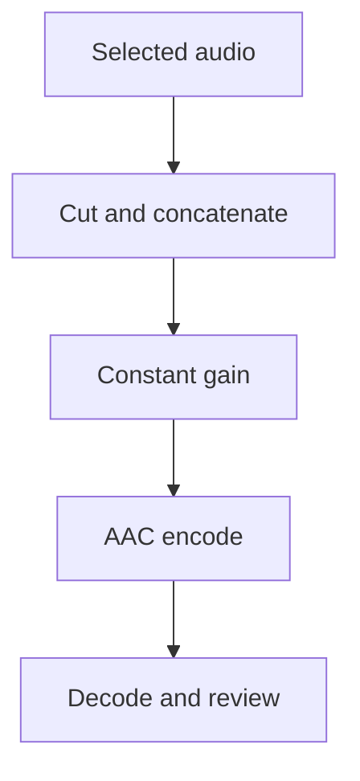

# Constant audio attenuation

Use a constant attenuation profile when a measured audio-level problem calls for
a quieter candidate. The profile belongs to the edit plan, so review and master
renders use the same gain.

## Set or restore the level

Run these commands from the repository root after `uv sync --locked`.
After building a plan, read its current revision:

```sh
uv run --locked talkcut status PROJECT --json
```

Apply the change with a reason:

```sh
uv run --locked talkcut plan set-audio-profile PROJECT \
  --gain-db=-1 \
  --reason "Measured output peaks require a quieter candidate" \
  --expected-revision REVISION \
  --json
```

Replace `PROJECT` with the project directory and `REVISION` with its current
integer revision. A stale revision is rejected. To return to the original level,
run the same command with `--gain-db=0`, a current revision and a reason.

| Property | Contract |
| --- | --- |
| Schema | `audio-processing/v1` |
| Default gain | `0` dB |
| Accepted values | Canonical rational strings from `-12` to `0`, such as `-1` or `-3/2` |
| Rejected values | Amplification, decimals such as `-1.5`, unreduced fractions such as `-2/2`, arbitrary filters and time-varying gain |
| Scope | One constant profile for the entire plan; no per-render gain override |

## What the change does

The command creates a new immutable plan and timeline, records the reason in
project history, clears the active render and invalidates output QC, seam review,
whole-output review and readiness. Original media, prior plans, reviews and
successful outputs remain available. Later plan builds inherit the project's
profile; restoring a cut retains it.



The renderer applies gain after concatenating the audio cuts and before AAC
encoding. It retains the selected single audio source, sample rate, channel order,
sample schedule and video PTS. Zero gain adds no filter to the audio graph. The
existing master synchronization and test-only guards still apply.

The profile participates in the plan, timeline, render settings and cache identity.
QC checks these bindings; render verification also checks the exact FFmpeg recipe.
Changing gain does not rewrite an older artifact or give it a new execution
receipt. See [architecture](architecture.md#revisions-retain-the-evidence-trail)
for the revision model.

## Review the encoded candidate

Attenuation does not by itself establish that clipping is resolved or that the
audio sounds acceptable. Lossy AAC encoding can produce a larger decoded transient
even when every pre-encoder PCM sample is smaller. Recheck the complete actual
encoded candidate and resolve source/output findings through the normal
[audiovisual review](validation/lecture-review-protocol.md) before preparing an
owner handoff.

The [synthetic audio regressions](../tests/test_audio_processing.py) measure float
PCM gain, AAC peaks and RMS, channel correlation, sample counts, video PTS, exact
zero-gain restoration and cache invalidation. These tests establish the behavior
of the processing path; lecture quality still needs review of the actual media.
