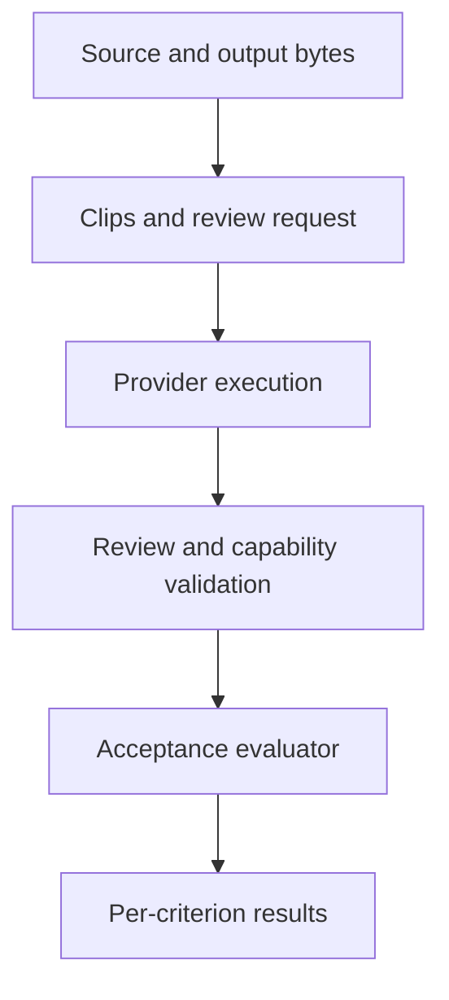

# Evidence reference

This reference covers strict review imports, rejected evidence and acceptance
checkers. The [acceptance guide](acceptance.md) provides the workflow and explains
each readiness status. Return to the [documentation index](README.md) for other
guides.

An evidence record must lead back to the bytes that were checked and the
execution that checked them. A hash establishes byte identity; it does not prove
semantic truth or provider authenticity. Actual media inspection and independent
audit remain necessary.

## Follow an artifact through the review chain



This is the review path. Acceptance also requires current editorial bindings and
recomputed technical measurements. The arrows describe dependencies, not completed
gates. Review requests bind the
source, code, contract, plan, timeline and output identities appropriate to their
scope. Extraction receipts bind the actual clip to its parent media and interval.
The importer then checks the provider's execution, observations and capability.
Acceptance revalidates the evidence against the current final state.

Render execution records preserve the worker's actual stdout, stderr and exit
status and register the resulting media references. Review imports register
verified execution and capability references. Both preserve diagnostic flags and
unverified status; indexing an artifact does not turn it into approval.

| When this changes | Rebuild or revalidate |
| --- | --- |
| Source bytes or stream selection | Inspection and every dependent mapping, analysis, plan, render and review. |
| Timing, layout or audio processing | Affected media and synchronization evidence, technical QC and final output reviews. |
| A cut decision or boundary | The plan/timeline, affected deletion and seam evidence, output QC and final whole-output review. |
| Reviewer, prompt, extraction or input clips | The affected reviews and decisions/readiness that depend on them. |
| Code or output bytes | Evidence bound to the previous code/output identity, including editorial binding. |

Use the full invalidation rules in the frozen
[review protocol](validation/lecture-review-protocol.md#12-수정과-회귀-검증의-무효화)
when deciding which unchanged source evidence can be reused. Old artifacts remain
available as history. A matching filename, candidate ID or timestamp is not
enough to reuse a result.

## Run a typed measurement

```sh
uv run --locked talkcut acceptance measure projects/my-lecture --check CHECK_ID --input RAW_INPUTS_JSON --contract projects/my-lecture/frozen-contract.local.json --json
```

The command runs the checker in a separate process and preserves its actual
stdout, stderr, exit code and immutable evidence receipt. A zero exit means the
measurement completed. Unknown values stay `null`, and the response's
`acceptance_status` remains `UNVERIFIED`. Run `acceptance evaluate` to recompute
the values and apply the frozen requirements.

Measurements require the registered inputs, current inspection, plan, timeline
and render. An unrelated successful process log, copied result or hand-entered
`PASS` cannot replace the underlying source artifacts.

## Find the input format

The CLI does not accept a generic collection of verdicts. Each checker or importer
has its own versioned input contract. Follow the definitions below when preparing
inputs; tests show accepted and rejected constructions.

| Evidence or input | Definition and examples |
| --- | --- |
| AC01 through AC13 and every `CHECK_ID` predicate | [`contracts.py`](../src/talkcut/contracts.py); [`acceptance.py`](../src/talkcut/acceptance.py) applies them. |
| Published acceptance manifest | [`acceptance-manifest.schema.json`](../schemas/acceptance-manifest.schema.json). The same schema ships inside the package. |
| Source synchronization model and anchor evidence | [`sync.py`](../src/talkcut/sync.py), [`sync_checks.py`](../src/talkcut/sync_checks.py). |
| Transcript, audiovisual context and conservative analysis | [`analysis.py`](../src/talkcut/analysis.py), [`review.py`](../src/talkcut/review.py), [`context_collection.py`](../src/talkcut/context_collection.py). |
| Review request, capability and imported provider record | [`review.py`](../src/talkcut/review.py); [`test_review.py`](../tests/test_review.py). |
| Editorial snapshot, binding and no-safe-cuts audit | [`editorial_binding.py`](../src/talkcut/editorial_binding.py); [`test_editorial_binding.py`](../tests/test_editorial_binding.py). |
| `baseline` | The `baseline-input/v1` branch in [`acceptance.py`](../src/talkcut/acceptance.py). |
| `geometry_audio`, `output_technical` | [`quality_checks.py`](../src/talkcut/quality_checks.py). |
| `boundaries` | [`boundary_checks.py`](../src/talkcut/boundary_checks.py). |
| `editorial_fixture` | [`editorial_checks.py`](../src/talkcut/editorial_checks.py). |
| `recovery`, `workflow_e2e` | [`measurement_checks.py`](../src/talkcut/measurement_checks.py). |
| `failure_injection`, including optional provider controls | [`failure_checks.py`](../src/talkcut/failure_checks.py). |
| `reproducibility`, `release_privacy` | [`reproducibility_checks.py`](../src/talkcut/reproducibility_checks.py), [`privacy_checks.py`](../src/talkcut/privacy_checks.py). |

The frozen [contract](plans/0002-autonomous-goal-contract.md) and
[review protocol](validation/lecture-review-protocol.md) explain why the checks
are required. The source definitions above specify the current executable input
formats; the protocol's example field list is not a runnable configuration.

## Provider and composite review

An audiovisual capability record must come from an executed challenge with known
audio and visual events. Attaching a media file, supplying a transcript or naming
a model does not show what the model observed. A review also needs actual
observation intervals, modalities, findings and execution completion.

A composite review combines four recorded inputs to one calibrated recipe:

1. The actual audio-model execution and its complete PCM intake trace.
2. Physical analysis of that PCM waveform.
3. Timestamped images extracted from the same clip.
4. A separate final reviewer execution using those results.

The CLI image route checks the original session, raw child results, input hashes
and process completion. An independent registration audit must validate the
execution graph and recipe. Diagnostics cannot acquire reviewed status by being
relabelled later. See [`composite_review.py`](../src/talkcut/composite_review.py),
[`composite_registration.py`](../src/talkcut/composite_registration.py) and the
[`composite review tests`](../tests/test_composite_review.py).

Composite semantic review currently does **not** support precision approval for
dense motion or lip synchronization. More images or a confident response do not
remove that limitation. Unsupported precision obligations remain unverified.

### Native requests bound to an output

An output-bound native request must capture the complete output hash before
execution and check the bytes and file identity again afterward. A legacy audio
diagnostic cannot acquire that scope after it finishes.

The [`native_candidate` adapter](../src/talkcut/native_candidate.py) can prepare
an explicitly unregistered intake candidate from an original bounded process and
complete PCM trace. This proves neither audited registration nor calibrated
semantic review. Independent registration and final composite validation must
recheck the original evidence after the terminal reviewer finishes. The
[`native candidate tests`](../tests/test_native_candidate.py) cover those limits.

## Exercise provider failure controls

These controls need an unchanged, current, successful audiovisual review import
and complete references to its sources, output, contract and timeline. Run them
in a separate private output directory:

```sh
uv run --locked python -m talkcut.provider_failure_checks --input PROVIDER_INPUT_JSON --repo . --output projects/provider-controls
```

The closed `provider-failure-input/v1` format has `schema_version`, `positive`,
`subjects` and `dependencies`. Its validator is in
[`provider_failure_checks.py`](../src/talkcut/provider_failure_checks.py).

For each of six fixed faults, the harness validates the original successful
import, injects the fault through production import gates, and then reruns the
unchanged successful import. It checks byte conservation and verifies that the
failed control cannot later authorize a real review.

| Fault | Intended failure |
| --- | --- |
| `provider_timeout` | Review execution did not complete successfully. |
| `modality_missing` | Required audiovisual observation is absent. |
| `invalid_review_timestamp` | Observation timing is outside the allowed request. |
| `empty_review` | There is no usable review content. |
| `truncated_review` | The response is incomplete. |
| `budget_exhaustion` | The provider reported an exhausted budget. |

Timeout and budget cases inject normalized failure outcomes; they do not exhaust
a provider or account. The controls execute no models. Their retained fault
artifacts are labelled counterfactuals with zero review coverage.

Attach the returned run reference as `provider_controls` in the existing
`failure-input/v1` measurement input. Without an actual successful audiovisual
import, provider controls remain unverified. Synthetic fixture success cannot
replace that prerequisite. The producer exits `0` when its controls execute and
`2` when they cannot; acceptance credit still requires measurement verification.
See the [`provider control tests`](../tests/test_provider_failure_controls.py).

## Exercise the evaluator's negative cases

```sh
uv run --locked python -m talkcut.evaluator_negative run --repo . --output projects/evaluator-controls --positive-controls POSITIVE_REGISTRY_JSON
```

The fixed harness tests ten attempts to bypass acceptance:

| Cases | Required successful controls |
| --- | --- |
| Duplicate coverage, wrong hashes, hidden deletion, sample export, threshold tampering, success despite error exit, renamed partial output | Generated technical fixtures establish the expected valid behavior. |
| Transcript-only review, always-keep editing, fabricated approval | Actual current audiovisual reviews and complete independently reviewed editorial fixtures establish the relevant valid behavior. |

The `evaluator-av-positive-controls/v2` registry references individual
`evaluator-av-positive/v2` envelopes. Their closed formats and current dependency
checks live in [`evaluator_av_controls.py`](../src/talkcut/evaluator_av_controls.py).
Providing a registry binds evidence; it does not approve its contents.

Each intended rejection needs a valid successful control, measured conservation,
recovery with the unchanged control and refusal to reuse the counterfactual as
approval. Saved observations must match a fresh execution. A failure at an
unrelated earlier gate cannot establish the intended defense.

Omitting `--positive-controls` still runs the seven technical cases. The three
missing audiovisual/editorial controls stay `null`, all ten remain in the
denominator, and the aggregate is `UNVERIFIED` with exit code `1`. See
[`evaluator_negative.py`](../src/talkcut/evaluator_negative.py) and the
[`audiovisual control tests`](../tests/test_evaluator_av_controls.py).

## Interpret coverage

Coverage uses unions of verified observation intervals from the actual source,
deletions, seams and final output. Repeated or overlapping windows do not add
extra credit. A zero deletion count is a zero denominator, not proof that an
editing review succeeded.

Technical comparisons, semantic review and owner acceptance retain separate
results. The [`acceptance tests`](../tests/test_acceptance.py) and
[`independent evaluator tests`](../tests/test_evaluator_independent.py) exercise
these boundaries, including forged approval and reuse of unrelated receipts.
Keep recordings, transcripts, review evidence and credentials private when
collecting logs or publishing a failure report.
