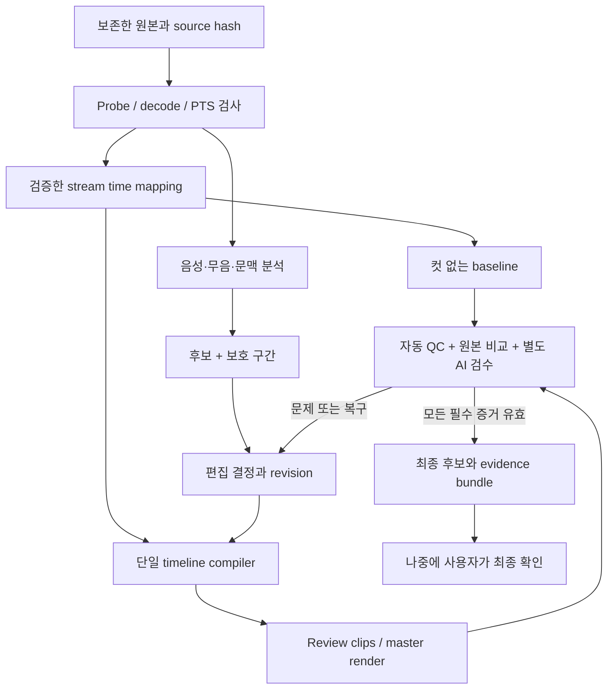

# RFC 0001 — DGIST 첫 강의 완성본을 만드는 TalkCut 워크플로

| 항목 | 내용 |
| --- | --- |
| 상태 | 구현 계획 초안 · 아직 구현하거나 강의 품질을 인증한 문서가 아님 |
| 작성일 | 2026-09-07 |
| 기준 코드 | `cde2832` · Talkcut 0.0.1 초기 scaffold |
| 제품 책임자 / 최종 확인 | Yunsung Lee · 구현이 끝난 최종본을 나중에 확인 |
| 구현·중간 검수 책임 | TalkCut maintainer와 agent; 자동 검사 + AI 전수 검수·수정 반복 |
| 첫 대상 | DGIST W02의 screen + speaker 원본으로 만드는 강의 master |
| 관련 문서 | [검수·출하 프로토콜](../validation/lecture-review-protocol.md), [자율 목표·달성 계약](0002-autonomous-goal-contract.md), [실행 프롬프트](../prompts/dgist-autonomous-goal.md), [현재 README](../../README.md) |

## 1. 결론과 성공의 정의

첫 제품은 **원본을 넣고, 근거가 있는 편집을 적용하고, 실제 결과를 검수하고, 문제 구간을 복구한 뒤 같은 작업을 재실행할 수 있는 강의 편집 CLI**다. DGIST 한 편을 끝까지 완성하는 것을 첫 milestone로 삼는다. 범용 영상 편집기나 자막 제품으로 범위를 넓히지 않는다.

핵심 순서는 **입력 보존 → 시간축 검증 → 컷 없는 전체 합성본 → 한 컷의 적용·검수·복구 → 자동 후보 생성 → 전체 편집본의 반복 검수 → 최종 확정**이다. 각 단계는 다음 단계가 믿고 사용할 증거를 남긴다. 마지막에 한 번 검사하는 방식으로 품질을 확보하지 않는다.

여기서 “첫 완벽한 편집”은 다음 계약을 모두 만족하는 **특정 입력·편집 revision·출력 파일**을 뜻한다.

- Screen의 전체 프레임·해상도·표시 비율을 유지하며, 작은 speaker 전체 프레임을 우측 상단에 겹친다.
- 선택한 단일 음원, 발표자 화면, 화면의 사건이 검증한 공통 시간축에 맞는다.
- 학습에 필요한 설명·시연·질문 대기·정답 공개 순서를 보존한다.
- 삭제 이유, 원본 구간, 실제 적용 경계, 검수 결과가 추적 가능하며 삭제를 되돌릴 수 있다.
- 검수하지 않은 치명적 항목, 실패한 검사, 오래된 승인으로 최종본을 확정하지 않는다.
- 최종 MP4와 그 파일에 대응하는 편집 계획·시간 매핑·검수 기록을 함께 보관한다.

단일 강의의 합격은 모든 강의에 대한 무오류 보증이나 OSS의 일반 성능 입증이 아니다. 아래 수치와 일정은 **개발 목표**이며 실측 성능이 아니다.

## 2. 확정된 요구와 설계 제안

### 2.1 사용자와 이미 합의한 사항

| ID | 요구 | 설계에 미치는 영향 |
| --- | --- | --- |
| R01 | Screen 전체와 원본 비율 유지 | Crop, stretch, screen 축소, 장식 여백 추가 금지 |
| R02 | 아주 작은 speaker를 우측 상단에 overlay | Speaker 전체 프레임과 비율 유지; 별도 패널 배치 금지 |
| R03 | 시간과 소리의 정확한 sync | 오디오 상관관계만으로 video sync를 확정하지 않음 |
| R04 | 명확한 강의 전 구간·긴 무음은 자동 삭제 | 매 컷의 사전 허가를 요구하지 않되, 근거·사후 검수·복구 제공 |
| R05 | 버벅임은 말더듬·반복·재시작 | 검수 후 삭제. 중간 검수자는 R11에 따라 AI로 위임; 프레임 끊김 복원은 별도 문제 |
| R06 | 모호하면 유지 | 검출기가 판단하지 못해도 임의 삭제하지 않고 작업은 계속 |
| R07 | Agent·CLI 우선 | Python 3.12+, uv, argparse, FFmpeg/ffprobe; 전용 GUI는 후속 |
| R08 | Local media 처리 + 선택적 cloud 분석 | Cloud는 명시적으로 설정하기 전 비활성; provider와 비용 기록 |
| R09 | Public OSS, 자체 코드 MIT | 원본·비공개 transcript·검수 영상은 공개 저장소에 포함하지 않음 |
| R10 | 첫 완성본은 합성·싱크·컷·음질 | 2026-09-07 추가 답변. 자막·챕터는 후속 milestone |
| R11 | 자동 검사와 AI 검수를 엄격히 수행하고, 사용자는 구현 완료 후 최종본만 확인 | 같은 날 추가 답변. 중간 컷·배치·음원 검수는 AI가 전담하고 마지막 사용자 확인을 분리 |
| R12 | 기존 연결된 AI 도구로 필요한 구간 전송 허용; 별도 유료 API는 사전 확인 | 2026-09-07 새 구현 세션 위임. 기본 제품 설정은 off를 유지하되 DGIST 실행 profile에 허용을 기록 |
| R13 | 코드·문서 push, PR 병합, 버전 release까지 자율 진행 | 실제 녹화·편집본·비공개 검수 자료는 공개하지 않음 |
| R14 | 별도 Codex token budget 없이 계정 한도·앱 설정 안에서 진행 | 외부 API 과금 허용과 별개; 예산·한도 소진은 완료 아님 |

이전 탐색 문서의 crop, slide reconstruction, bilingual caption 우선 제안보다 위 합의가 우선한다. 원본에 녹화된 browser나 caption panel도 현재 요구에서는 보존 대상이다.

### 2.2 이번 계획의 제안값

- 첫 DGIST 출하에서는 AI가 자동 삭제까지 포함해 **모든 삭제 구간을 사후 검수**한다. 반복 개발 중에는 변경 구간을 집중 검수하고, 최종 후보는 전체 범위의 audio·video 검수를 수행한다.
- Speaker 폭 12.5%, margin 1%는 기존 예시의 임시 시작값이다. 최종 값은 대표 장면을 보고 정한다.
- Sync 허용치, 무음·발화 경계 설정, ASR backend, 인코딩 설정은 아래 실험과 gate를 거쳐 고정한다.
- 중간 검수는 컷 제안 역할과 별도 AI 검수 역할로 나눈다. 불일치·근거 부족은 keep/restore로 수렴시킨다. AI 검수 완료는 `READY_FOR_OWNER`, 이후 사용자의 실제 최종 확인은 `OWNER_ACCEPTED`로 분리한다. 사용자의 시청 범위도 실제대로 기록하며 AI가 대신 서명하지 않는다.

R11은 이전의 “발화 삭제마다 사용자 확인” 흐름을 중간 AI 검수 위임으로 갱신한다. 이후 R12에서 기존 연결된 AI 도구로 필요한 구간을 전송하는 범위도 명시적으로 허용했다. 검수 요건과 새 유료 API 사전 확인은 유지한다.

## 3. 현재 사실과 아직 모르는 것

### 3.1 이번 계획 작성 중 확인한 사실

현재 [CLI](../../src/talkcut/__main__.py)는 help/version만 제공한다. 실제로 `uv run --locked talkcut --help`, `--version`을 실행했다. [패키지](../../pyproject.toml)의 runtime dependency는 비어 있고, 설정 JSON은 아직 읽지 않는다. inspect, sync, cut, ASR, render, QC, resume, 테스트·CI는 아직 구현되어 있지 않다.

완전 다운로드된 세 파일이 남아 있음을 확인하고 ffprobe metadata를 다시 읽었다. 아래는 **입력 관측값**이며 전체 decode나 동기화 통과 결과가 아니다.

| Source | Container duration | Video duration | 용도 |
| --- | ---: | ---: | --- |
| `screen` | 3423.248254 s | 3423.239044 s | 전체 canvas와 기준 presentation timeline |
| `speaker` | 3423.225034 s | 3423.206044 s | 작은 발표자 overlay; audio 후보 |
| `mixed-retry` | 3423.178594 s | 3423.159667 s | 학교 기존 결과와 비교; 기본 render 입력 아님 |

- 세 video: H.264 High, 1920×1080, yuv420p, `time_base=1/45000`, reported nominal rate `1000/33`, start PTS 0.
- 세 audio: AAC-LC, 44,100 Hz, stereo, `time_base=1/44100`, start PTS 0. **Audio stream index는 0, video는 1**이다. Stream 0을 video로 가정하지 않는다.
- 평균 frame rate는 source별로 약간 다르다. Screen의 세 시점에서 읽은 36개 packet duration은 33 ms였지만, 전체 CFR·연속성의 증거는 아니다.
- 완전 다운로드 파일 세 개의 합계는 약 2.67 GB다. 불완전한 `mixed.mp4`도 있어 자동 파일 선택으로 잘못 고르지 않아야 한다.
- 원본은 아직 OS 임시 디렉터리에 있다. 영속 보존과 SHA-256 고정은 첫 구현 실행의 선행 작업이다. 이 문서는 원본을 옮기거나 변경하지 않았다.
- 현재 로컬 FFmpeg는 8.1.2다. 이를 프로젝트의 유일한 지원 버전으로 확정한 것은 아니다.

이전 조사에서 02:00·25:00·55:00의 각 20초 audio를 비교했을 때 screen은 speaker 대비 +46.5 ms 늦게 나타났다. 이는 **이전의 제한된 audio 측정**이며 이번에 상관관계를 재측정하지 않았다. 같은 program audio의 지연 복제라는 해석을 뒷받침하지만, video 이동값·lip sync·전체 drift·음질 우열은 확정하지 못한다.

기존 frame 조사에서는 우측 caption panel, 고정 wide speaker shot, demo 장면, 질문 slide를 관측했다. **우측 상단 PiP가 영어 캡션을 가릴 수 있다.** 자동 crop이나 위치 이동으로 해결한 것으로 처리하지 않고 R01/R02 안에서 실제 배치를 검수한다.

### 3.2 구현 전에 해소할 불확실성

| 질문 | 해소 단계 | 해소하지 못했을 때 |
| --- | --- | --- |
| 전체 입력이 정상 decode되고 PTS가 일관적인가? | M1 전체 stream 검사 | 손상 구간 표시; 정상 입력 확보 또는 지원 범위 재결정 |
| 일정 offset으로 충분한가, drift·중간 불연속이 있는가? | M2 다중 anchor와 잔차 분석 | 확정 전 master 단계 진행 금지; 대응 범위만 별도 구현 |
| 어느 음원이 가장 적절하며 video와 실제로 맞는가? | M2 청취 + 시각적 사건 검증 | 음원 선택을 null/미검증으로 유지 |
| 첫 실제 강의 발화는 언제 시작되는가? | M4/M5 AI의 원본 audio·video·문맥 검토 | 첫 의미 있는 발화 이전이라는 증거가 없으면 유지 |
| 무음 demo·읽기·질문 대기가 어디에 있는가? | M4 보호 구간 작성, M5 분석 | 해당 범위 자동 삭제 비활성 |
| 작은 PiP가 가독성과 발표자 식별을 함께 만족하는가? | M3 대표 장면 비교 | 허용 범위에서 폭·margin 재조정; 해결 불가 시 구체적 대안 검토 |
| 자동 후보 검수가 수동 편집보다 효율적인가? | M5/M6 시간·오류 기록 | 기능 범위를 줄이고 검증된 합성·cut/restore CLI 유지 |

## 4. 범위와 지원 계약

### 첫 DGIST milestone에 포함

명시적 source 등록·보존, 전체 probe/decode, audio 선택, offset/drift 진단, 검증 가능한 시간 매핑, 고정 PiP, 보수적 intro/silence 후보, AI 검수 후 disfluency cut, 보호 구간, 원본/편집 비교 클립, 적용·복구, 반복 render, 자동 QC, AI 검수와 사용자 최종 확인 기록, 작업 재개, 최종 산출물 묶음.

지원 입력은 먼저 **이번에 실제 측정한 H.264/AAC SDR screen+speaker 조합**으로 제한한다. PTS의 불규칙성이 있으면 범위와 처리 방식을 M1/M2에서 명시한다. “MP4를 읽는다”는 이유로 모든 VFR, HDR, 회전, anamorphic, 다중 독립 마이크를 지원한다고 쓰지 않는다. 해당 입력은 지원하지 않는 이유를 설명하고 종료한다.

### 후속 단계

검수한 원어 transcript와 SRT/VTT, 번역 자막·chapters, review UI, 다른 강의·제작자의 입력, podcast policy, NLE interchange. 자막이 나중에 붙어도 같은 source→output mapping을 사용한다. 자막 문장 재구성과 번역 품질 검증은 별도 범위다.

### 이번에 하지 않는 것

Full timeline editor, 자동 카메라 감독, face tracking/crop, slide 재제작, 강의 내용 요약에 따른 재배열, B-roll, 생성 음성, speech repair, LMS 업로드, 기관 연락, SaaS·계정·서버 orchestration. Caption panel을 없애거나 중요한 영상 부분을 가리는 행위를 조용히 추가하지 않는다.

## 5. 사용자가 경험할 작업 흐름

아래 명령은 **제안하는 interface**다. 현재 CLI에서 실행되지 않으며 M1–M6에서 단계적으로 구현한다. `P`는 실제 녹화 경로를 담는 비공개 project 디렉터리다.

```text
talkcut doctor
talkcut init P --screen <path> --speaker <path>
talkcut inspect P --full-decode
talkcut sync analyze P
talkcut render P --plan <baseline-plan-hash> --profile review
talkcut review build P --plan <plan-hash>
talkcut analyze P --profile lecture
talkcut plan build P
talkcut plan decide P --candidate <id> --decision accept --expected-revision <n>
talkcut plan restore P --candidate <id> --expected-revision <n>
talkcut render P --plan <plan-hash> --profile master
talkcut qc P --render <render-id>
talkcut prepare-release P --render <render-id>
talkcut finalize P --render <render-id> --owner-signoff <review-id>
```

1. **입력 준비:** source ID를 명시한다. 임시 파일이면 영속 위치로 검증 복사하고 원본을 보존한다. Read-only 외부 참조도 지원하되, 원본이 사라지면 경로 재연결을 요구한다.
2. **진단:** dependency, disk, stream, decode, PTS, source coverage 보고서를 만든다. 원본 내부 문제와 TalkCut에서 새로 생긴 문제를 구분한다.
3. **시간·화면 기준 확정:** AI가 sync anchor와 원본을 비교해 실제 음원을 선택한다. 아직 컷하지 않은 대표 합성 클립으로 PiP와 audio를 검수하고, 전체 baseline을 만든다. 기존 합의 안의 크기·여백 조정은 중간 확인을 요청하지 않는다.
4. **안전한 편집 기반:** 검증용으로 명시한 한 컷으로 적용→AI 검수→복구→재실행을 완주한다. 이 경로에 자동 후보 생성기를 연결한다.
5. **후보 검토:** 명확한 intro/silence는 정책에 따라 draft에 적용한다. 말더듬·재시작은 별도 검수 agent가 원본 문맥·음성·영상을 확인한 후에만 삭제한다. 검수 대상에는 원본 구간, 삭제 이유, 원본/편집 클립을 함께 제공한다.
6. **반복 수정:** AI 검수의 문제 제기를 candidate ID와 source span에 대한 변경으로 기록한다. 영향받은 클립·QC·승인을 다시 만든다. 불명확한 삭제는 복구하고 진행하며, 사용자는 나중에 같은 경로로 수정할 수 있다.
7. **최종 전달:** 모든 필수 자동·AI 검사가 같은 output hash에 대해 통과하면 `prepare-release`가 최종 후보와 짧은 결과 보고서를 준비한다. 사용자가 나중에 최종본을 보고 확인하면 `finalize`가 해당 사용자 결정을 기록한 로컬 완료 묶음을 생성한다. 두 명령 모두 업로드나 게시를 하지 않는다.

검수 화면을 만들기 전에도 numbered candidate 목록, Markdown/JSON report, 실제 MP4 비교 클립으로 AI가 검수할 수 있어야 한다. 사용자에게 중간 클립 확인을 반복 요청하지 않는다. Agent 대화 내용만이 승인 원장이 되어서는 안 된다.

## 6. 구조: 작은 Python core와 검증 가능한 artifact



### 6.1 모듈 경계

| 모듈 | 책임 | 하지 않는 일 |
| --- | --- | --- |
| `project` / `schema` | source manifest, schema version, revision, hash, migration | 임의 shell 실행, editorial 판단 |
| `media` / `probe` | subprocess 실행, stream/PTS/decode 진단, capability 확인 | duration만으로 sync 확정 |
| `sync` / `timebase` | anchor, rational mapping, coverage, 불확실성 | 검증되지 않은 video 보정 추정 |
| `analysis` / `policy` | evidence와 후보 생성, 보호 구간, auto/review 분류 | 직접 FFmpeg 명령 생성·자기 후보의 검수 완료 선언 |
| `timeline` | 결정된 retained intervals → resolved timeline | LLM 호출, 암묵적 재배열 |
| `render` | 동일 timeline으로 review/master, 종료·자원 관리 | 자체 cut 결정, silent fallback |
| `review` / `qc` | 별도 AI 검수, 검사 결과, 비교 클립, ledger, 완료 gate | 미검증을 pass로 간주하거나 사용자 확인을 대행 |

CLI와 미래 agent adapter는 같은 Python application API를 호출한다. 초기에는 프로세스 하나와 파일 기반 artifact로 충분하다. Database, workflow service, task queue, plugin framework를 선행 구축하지 않는다.

모든 작업 명령은 향후 `--json`으로 versioned 결과를 제공한다. 제안 envelope는 `schema_version, operation, project_revision, status, artifact_refs, findings, next_actions`다. 진행 로그는 stderr, 기계 결과는 stdout으로 분리한다. 실패에는 안정적인 `code`와 `retryable`, 대상 구간, 필요한 복구 동작을 넣는다. 초기 code 후보는 `SOURCE_CHANGED`, `UNSUPPORTED_TIMING`, `SYNC_UNVERIFIED`, `STALE_REVIEW`, `REVIEW_MODALITY_MISSING`, `BUDGET_EXCEEDED`, `RENDER_FAILED`다. Nonzero 종료와 report artifact를 함께 제공하며 agent가 로그 문장을 해석해 성공을 추정하게 하지 않는다.

명령별 입력·출력 schema와 exit code는 구현 PR에서 contract fixture로 고정한다. `--dry-run`은 media를 변경하지 않고 입력 의존성, 예정 출력, 추정 비용을 보여준다. 파괴적 overwrite 대신 새로운 revision을 생성하며 같은 성공 작업의 재요청은 기존 artifact를 반환할 수 있어야 한다.

### 6.2 Dependency 결정

- Python 3.12와 uv 유지. Core는 dataclasses, argparse, pathlib, subprocess, `Fraction` 등 표준 라이브러리를 우선 사용한다. 유리수 시간 연산에는 [Python fractions](https://docs.python.org/3.12/library/fractions.html)를 사용할 수 있다.
- Schema validation은 공개 JSON Schema와 단일 validator를 기준으로 한다. Runtime validator가 필요해지는 M1에 추가하며 서로 다른 두 validation 체계를 운영하지 않는다.
- FFT 기반 audio 비교가 필요하면 `numpy`를 명시적 dependency/extra로 추가한다. FFmpeg Python wrapper보다 argument list로 직접 호출한다.
- 분석은 JSON transcript import를 먼저 지원한다. M5에서 local ASR 후보 하나를 실제 Korean/English 발화로 시험하고 버전·설치·속도·timestamp 품질을 기록한 뒤 채택한다. 공급자를 고르기 전 SDK 여러 개를 넣지 않는다.
- Cloud adapter는 선택된 하나부터 추가한다. Media 전송 범위·provider·model·budget을 설정해야 실행되고, 설정이 없으면 local/import/manual 경로를 사용한다.
- 개발 검사에는 pytest, property-based testing, lint/type check를 순차 도입한다. Media 통합검사에는 실제 FFmpeg를 사용한다.
- Python dependency는 lockfile로 재현한다. `uv sync --locked`의 lock 검증 동작은 [uv 문서](https://docs.astral.sh/uv/concepts/projects/sync/)에 따른다. FFmpeg binary와 model revision은 별도로 기록한다.

### 6.3 기존 OSS 재사용 판단

[OpenKlip](https://github.com/craftled/openklip)은 transcript cut/restore와 CLI·review 흐름을 제공하고, [Montaj](https://github.com/theSamPadilla/montaj)는 step 실행·workflow·render 구조를 제공한다. 공식 저장소 설명을 재확인했지만 **이번 입력의 sync·roundtrip 적합성은 시험하지 않았다.**

M4/M5 착수 때 최대 1 engineer-day의 adoption spike로 필요한 기능만 비교한다. 한 컷 복구, source timestamp 보존, speaker+screen roundtrip, 기존 검수 기록 재사용, 설치 비용을 시험한다. 요구를 충족하면 adapter로 재사용한다. 자료구조가 시간을 손실시키거나 별도 renderer 전체를 도입해야 하면 독립 core를 유지하고 transcript import처럼 작은 경계만 재사용한다. 코드 복사·dependency 도입 전 해당 revision의 license를 확인한다.

## 7. 시간축·편집 계약

### 7.1 Frame index 대신 presentation time

각 stream의 원래 정수 PTS와 time base를 보존한다. 내부 시간은 `{num, den}` 형식의 유리수 초로 직렬화하며 float 초는 화면 표시용이다. Python `Fraction(float)`로 원래 의미를 복원하지 않는다.

```text
source_time = pts × stream_time_base − source_origin
lecture_time = rate × source_time + offset
source_time = (lecture_time − offset) / rate
```

`source_origin`은 한 source의 audio/video가 공유하는 명시적 기준점이다. Audio와 video를 각각 자기 첫 프레임에 맞춰 0으로 만들면 원래 상대 시작차를 잃을 수 있다. 필요 시 stream별 검증한 offset/rate를 따로 저장한다. Screen video를 기준으로 `rate=1`, `offset=0`을 정의하되 다른 stream까지 0이라고 추정하지 않는다.

`offset > 0`은 해당 source 사건이 source local time보다 lecture timeline에서 늦게 배치된다는 뜻이다. 예를 들어 동일 사건이 source 10초, 기준 lecture 12초에 있으면 offset은 +2초다. 기존 +46.5 ms audio lag와 이 mapping parameter는 같은 의미가 아니며 직접 대입하지 않는다.

Offset fit과 drift fit을 비교하고, 사용하지 않은 anchor로 잔차를 확인한다. 일정 offset으로 충분하면 rate는 1을 유지한다. 선형 drift가 입증되면 검증한 보정기를 적용한다. 불연속이 있으면 하나의 affine 식으로 덮지 않는다. M2에서 piecewise mapping을 구현하거나 해당 입력을 명시적으로 차단한다.

Audio clock 보정은 어떤 sample을 어느 presentation time에 배치할지와 pitch에 미치는 영향을 함께 검증한다. Video에 적용한 `setpts` 식만 audio에 흉내 내어 실제 음성 길이까지 보정됐다고 간주하지 않는다. 초기 구현이 offset만 지원한다면 실제 drift가 gate를 넘는 입력은 해당 보정 PR 전까지 지원하지 않는 것으로 표시한다.

### 7.2 단일 retained-interval 목록

편집 결과의 기준은 lecture time의 정렬된 반열린 구간 `[a_i, b_i)`다. 모든 `b_i > a_i`, 겹침 없음, 시간 역행 없음, 보호 구간 삭제 없음이어야 한다.

```text
output_start_i = sum(b_j − a_j), j < i
output_time = output_start_i + lecture_time − a_i
expected_duration = sum(b_i − a_i)
```

같은 구간과 mapping을 screen, speaker, 선택 audio에 적용한다. 삭제된 source time에는 output 대응값이 없음을 명시한다. Cut ID는 원본 시간과 evidence에 연결하고, output timestamp만으로 식별하지 않는다. Restore는 원본 구간을 되살리고 timeline을 다시 compile한다.

### 7.3 경계 양자화와 누적 오차

- Requested boundary와 실제 적용 boundary를 모두 저장한다. Screen 경계는 실제 presentation-frame edge에 맞추고, 허용된 speech handle을 침범하면 해당 컷을 보류한다.
- Audio sample boundary는 출력의 **누적 절대 경계**에서 계산한다. `N_i = round(Fs × output_boundary_i)`, 구간 길이는 `N_(i+1) − N_i`다. 각 컷 길이를 독립 반올림해 100개 컷 뒤에 누적 오차를 만드는 방식을 피한다.
- Rounding tie rule, 마지막 frame의 presentation duration, encoder priming/padding 처리는 render specification에 기록한다. Container duration 하나로 정확성을 판정하지 않는다.
- Canonical mapping은 유리수로 보존하고, 최종 frame/sample grid에서의 오차를 QC가 측정한다. 실제 지원 범위에서 이 계약을 충족하지 못하면 render를 성공 처리하지 않는다.

### 7.4 Source가 없는 구간

| 상황 | 기본 정책 |
| --- | --- |
| Screen 또는 선택 audio가 retained interval을 덮지 못함 | Master 차단, uncovered interval 보고. 음소거·정지 화면으로 조용히 메우지 않음 |
| Speaker가 늦게 시작하거나 먼저 끝남 | 누락 구간은 screen-only로 계획에 명시; frozen speaker/화면 전체 조기 종료 금지 |
| Speaker 중간 gap 또는 불연속 | 해당 구간 표시 후 screen-only 또는 지원 차단; 명시적 policy와 검수 필요 |
| Codec 끝 padding과 실제 소스 부족 구분이 불명확 | 미검증으로 유지; decoded sample/frame coverage로 재검증 |

Speaker omission은 review 목록에 반드시 나온다. 사용자가 전 구간 speaker를 요구하면 보존 가능한 공통 범위를 검토하되 끝부분을 임의 삭제하지 않는다.

## 8. Artifact·결정·재실행 계약

### 8.1 비공개 project 레이아웃 제안

```text
projects/<project-id>/                 # 전체 gitignored
  project.json                        # source 등록, 설정 revision, active references
  sources/                            # 선택적 검증 복사; 외부 참조도 가능
  evidence/<content-hash>/             # probe, PTS, sync anchors, transcript
  plans/<plan-hash>.json               # immutable edit plan
  timelines/<timeline-hash>.json       # actual boundaries + source/output mapping
  review/events.jsonl                  # append-only decisions / supersession
  renders/<render-id>/                 # manifest, log, partial 또는 성공 artifact
  reports/<report-id>/                 # machine-readable QC + human summary
  releases/<release-id>/               # finalized manifest + MP4 references
```

Raw media·개인 transcript·기술 로그는 공개 예시와 분리한다. 현재 `.gitignore`의 `projects/`를 사용한다. 공개 fixture에는 직접 만든 합성 영상만 넣는다.

| Artifact | 반드시 포함할 필드 |
| --- | --- |
| Source manifest | schema, source ID, role, SHA-256, size, private path, stream index/type/time base, origin, coverage, probe version |
| Sync evidence | compared stream IDs, anchor times, method, residual/uncertainty, fit/holdout 구분, mapping revision, visual verification 상태 |
| Candidate | stable ID, source/lecture span, reason, evidence refs, protected-span intersection, proposed handles, auto/review/keep, detector version |
| Decision event | event ID, candidate ID, prior revision, action, human/AI/policy actor, delegated policy, reason, evidence revision, UTC timestamp |
| Edit plan | source hashes, sync/policy/layout/audio revisions, candidate decisions, retained spans, parent hash |
| Resolved timeline | plan hash, exact applied source/output spans, rounding, omissions, expected frame/sample schedule |
| Render manifest | timeline hash, profile, exact arguments/filtergraph, executable version/build, exit, resource usage, output hash |
| QC/signoff | render hash, check/rubric version, reviewer ID/model/prompt revision, 실제 clip/transcript hash, modality와 coverage, PASS/FAIL/UNVERIFIED, findings, supersedes |

Schema는 공개하되 private data가 포함된 project 자체는 공개하지 않는다. 초기 `draft-0`은 실제 입력 contract가 아니므로 M1에서 `v1` import/migration 방침을 명시한다. 알 수 없는 major version은 명시적으로 거절한다.

### 8.2 결정과 상태

Candidate는 `proposed → auto_applied | review_accepted | kept`, 적용 후에는 `restored`로 전환할 수 있다. Speech disfluency의 `review_accepted`에는 별도 AI 검수자의 근거와 위임된 policy가 필요하다. `auto_applied`는 합의된 정책으로 draft에 적용했다는 뜻이며, 검수 완료를 뜻하지 않는다. 사용자 결정은 별도 actor로 남긴다.

Artifact마다 `pending / running / succeeded / failed / stale`을 두고 의존관계로 실행 가능 상태를 계산한다. Project의 단일 상태 문자열만으로 모든 검사가 유효하다고 추정하지 않는다.

```text
DRAFT → RENDERED → QA_RUNNING → READY_FOR_OWNER → OWNER_ACCEPTED
                        ↓              ↓               ↓
                    FIX_REQUIRED ← 새 문제 / 의존 입력 변경
```

`READY_FOR_OWNER`는 필수 자동·AI 검사와 전 범위 coverage가 유효한 최종 후보다. `OWNER_ACCEPTED`는 그 파일을 사용자가 실제 확인한 뒤 기록한다. AI의 PASS를 사용자 확인으로 대체할 수 없다. 사용자 확인을 기다리는 동안 구현 완료 상태와 검수 증거는 보존되며, 미래의 시청을 미리 완료 처리하지 않는다.

Decision/restore에는 expected revision을 전달한다. 충돌하면 최신 상태와 차이를 반환하고 다른 결정을 덮어쓰지 않는다. Policy·span·evidence가 바뀌면 해당 검수 결정은 무효화한다. 같은 candidate ID라는 이유만으로 이전 결정을 승계하지 않는다.

### 8.3 중단·재개·cache

- Cache key는 직접 의존하는 artifact의 content hash, 설정, 알고리즘 version, backend/model/profile을 포함한다. Canonical JSON 직렬화 규칙을 정하고 self-hash·실행 시각은 hash 대상 payload에서 제외한다.
- 실행 전후 source identity를 확인한다. 파일 이동 후에도 같은 hash이면 재연결할 수 있지만 다른 내용이면 새 source다. 파일명·mtime만으로 확정하지 않는다.
- 한 project의 쓰기는 lock으로 직렬화하고 임시 파일→atomic replace로 확정한다. Event는 손상된 마지막 record를 탐지할 수 있어야 한다.
- Render의 `.partial`과 성공 결과를 분리한다. 정상 종료·기본 검사·hash 생성 후 확정하고 timeout/cancel/disk full로 기존 성공 결과를 덮어쓰지 않는다.
- 초기 resume는 **완료한 stage 재사용 + 실패한 encode 처음부터 재실행**이면 충분하다. MP4 중간부터 이어 쓰는 기능은 약속하지 않는다.
- Cloud retry는 기존 response/cache와 request ID를 확인하고 비용·횟수를 제한한다. 실패를 이유로 다른 provider에 조용히 재전송하지 않는다.
- 같은 timeline의 의미·시각 배치를 재현하는 것과 서로 다른 encoder/machine에서 MP4가 bit-identical한 것은 구분한다.

## 9. 편집 판단과 음질

### 9.1 자동 삭제의 근거 조건

무음 길이만으로 삭제하지 않는다. `clear`를 LLM의 confidence 0.99 같은 수치 하나로 정의하지 않는다.

| 후보 | 적용에 필요한 근거 | 부족할 때 |
| --- | --- | --- |
| Pre-lecture | 첫 실질 발화가 확인됨; 앞부분이 준비 구간이라는 근거; 설명·intro·과제 제시를 포함하지 않음 | Keep; 중간 사용자 확인을 요구하지 않음 |
| Long silence | 비발화의 음향 근거; 앞뒤 발화 경계; 문맥 확인; demo·읽기·질문 대기·영상 속 소리가 아님; protection에 교차하지 않음 | Keep |
| Stumble/repetition/restart | 제안과 별도인 AI 검수; 원본 문맥·음성·영상 확인; 정정·강조·부정·수치·조건 보존 | Keep/restore |
| Uncertain / detector unavailable | 자동 적용 불가 | 이유를 기록하고 keep |

Silent demo, 정지 slide를 읽는 시간, 질문 대기는 서로 다른 음성 없는 반례다. 화면이 정적이라는 것도 삭제 가능의 증거가 아니다. Transcript가 비어 있어도 무음으로 단정하지 않는다. Protected span은 demo, 질문·답변, 주의사항 등을 포함하는 근거 있는 source-time 구간이다.

M5 calibration에서는 무음 길이, 남겨둘 pause, 전후 handle을 여러 값으로 시험한다. 예를 들어 3/5/8초는 **후보 추출 실험값**이며 자동 삭제 규칙이 아니다. 근거가 부족해 모든 후보를 keep하는 것도 올바른 안전 동작이다. 다만 기능의 실용성은 별도로 평가하며, 아무것도 하지 않은 결과를 자동 편집의 성과로 과장하지 않는다.

### 9.2 Audio boundary와 음량

동일한 source interval을 세 track에 적용하고 audio만 별도의 의미 구간을 잘라내지 않는다. 짧은 fade는 발화를 손상하지 않을 때만 사용한다. Duration을 바꾸는 audio crossfade는 초기 기본 동작에 넣지 않는다. Audio processing profile과 seam 처리는 review/master에서 공유한다.

처음에는 원음을 보존하며 음원 선택, 결손, clip, noise, 좌우 channel을 측정하고 청취한다. Denoise, compressor, loudness normalization은 기본 off다. 실제 필요가 관측될 때만 profile을 추가하고 처리 전후 기술 용어·자음·호흡·demo 소리를 검수한다. 출력에서 새로운 clip이나 click이 생기면 수정한다. 원음 문제는 별도로 기록하고 출력에서 발견되지 않았다고 조용히 합격시키지 않는다.

### 9.3 AI 검수는 별도 실행 경로

제안 agent는 후보와 근거를 만든다. 검수 agent는 원본·편집 audio/video와 적용된 경계를 받아 삭제의 필요성, 의미 보존, 자연스러움에 반례를 찾는다. 첫 판단은 제안자의 설득 문장 없이 원본/편집 비교를 보고 작성하고, 다음에 제안 근거와 대조한다. 역할 분리는 통계적으로 독립적인 두 판단이나 정확도 보증을 뜻하지 않는다.

M1에서 reviewer capability를 먼저 시험한다. 실제 audio 청취, 움직임·입 모양 확인에 필요한 연속 frame/video 입력, 충분한 해상도, segment 길이, context 한도, 비용을 기록한다. ASR text와 저빈도 screenshot만 보는 검수자로 음질·lip sync까지 합격시킬 수 없다. 지원하지 않는 modality는 `UNVERIFIED`다.

자동검사와 AI 판단이 충돌하면 검수 범위를 넓히거나 경계를 수정한다. 기본 한도는 후보별 경계 수정 2회, 동일 원인 기술 수정·재검사 3회다. 해결되지 않는 삭제는 복구한다. Sync·원본 손상·전 구간 화면 충돌은 keep으로 해결되지 않으므로 완료를 차단하고 원인을 수정한다. 기한이나 token budget을 맞추려고 검수 기준을 낮추지 않는다.

Local/import 경로가 필수 멀티모달 검수를 수행할 수 있는지 M1 capability spike에서 확인한다. 불가능하면 선택적 cloud adapter에 필요한 설정과 전송 범위를 구체화한다. Cloud 비활성 설정을 우회하지 않는다. 분석 provider 선택과 별개로 검수 provider의 실제 입력 modality를 확인하고, 필요한 capability가 끝내 없으면 구현 한계로 명시한다.

## 10. Render와 preview의 일치

**하나의 timeline compiler와 FFmpeg graph builder**를 사용한다. Preview는 전체 resolved timeline에서 구간을 추출하며, 전역 frame/sample schedule을 유지한 뒤 재생용 PTS를 0으로 옮긴다. Local zero부터 sample 경계를 다시 계산하면 master와 반올림 위상이 달라질 수 있다. 최종 seam 검사는 실제 master에서 뽑은 클립으로 수행한다.

- Screen을 기준 canvas로 쓴다. SAR/DAR와 rotation도 검사하고 지원 범위 밖 입력을 무단 변환하지 않는다.
- PiP의 target 폭과 실제 정수 크기를 구분한다. 1920의 12.5%는 240px이고 16:9 높이는 135px이므로 chroma/encoder 제약을 시험한다. 필요하면 224×126, 256×144 등 비율을 정확히 유지하는 후보를 비교하고 실제 폭·margin을 기록한다.
- Speaker full frame을 유지한다. 얼굴 crop이나 추적을 추가하지 않는다. Caption을 가리면 작은 크기 등 합의 범위의 후보를 AI가 검수해 고른다. 모두 충돌하면 layout conflict로 기록한다.
- 초기 master 후보는 H.264/AAC MP4다. Software encode를 기준으로 검증하고 hardware encode는 별도 profile로 시각·시간 품질을 확인한 뒤 활성화한다. CRF/bitrate는 작은 글자와 움직이는 demo로 교정한다.
- Screen PTS 보존을 기본으로 하고 30fps로의 암묵적 변환을 금지한다. 실측 입력에서 segment concat 또는 timestamp selection 방식이 계약을 만족하는지 M2/M3에서 시험해 하나를 선택한다.
- `trim/atrim`만으로 timestamp가 0부터 시작하지 않는다. Concat과 overlay의 timestamp·끝 동작을 명시한다. FFmpeg의 [trim](https://ffmpeg.org/ffmpeg-filters.html#trim), [concat](https://ffmpeg.org/ffmpeg-filters.html#concat), [framesync](https://ffmpeg.org/ffmpeg-filters.html#framesync) 사양을 참고하고 실제 출력을 측정한다.
- Audio/video concat의 반올림·padding에 맡기지 않고 resolved timeline의 기대 길이, 실제 frame PTS, decoded audio sample 수를 검증한다.
- Source 부족을 `shortest`의 전체 종료나 마지막 speaker frame의 반복으로 숨기지 않는다.

## 11. 지속 검수와 완료 판정

[검수 프로토콜](../validation/lecture-review-protocol.md)을 완료 계약으로 삼는다. 검사 결과는 `PASS / FAIL / UNVERIFIED`와 실제 검수 범위를 가진다. 미실행·근거 부족·오래된 revision은 PASS가 아니다.

| Gate | 시점 | 완료 증거 |
| --- | --- | --- |
| G0 Inputs | 원본 등록 | 영속 source, hash, 전체 decode/PTS, 지원 형식·coverage |
| G1 Sync/layout | 컷 추가 전 | Audio 선택, 독립 anchor, offset/drift/lip-screen 정합, full-res PiP |
| G2 Edit safety | 후보 생성·변경마다 | Protection 불침해, AI 검수 결정, source/after 비교, restore |
| G3 Render | 각 render 후 | 전체 decode, 기대 duration/PTS/audio, 결손·새 black/freeze 등의 검사 |
| G4 AI editorial | 모든 삭제와 최종 출력 | 모든 삭제 원본·모든 seam·전체 출력 범위의 audio/video 검수 |
| G5 Ready for owner | 마지막 수정 후 | 동일 output hash의 G0–G4, 미해결 blocker 0, evidence bundle |
| G6 Owner acceptance | 사용자가 최종본 확인 후 | 실제 사용자 결정, 대상 hash와 시청 범위, 필요한 마지막 수정 처리 |
| G7 OSS alpha | 버전 공개 전 | 공개 fixture, clean install, docs/CI, 알려진 제한, 재현·복구 |

첫 DGIST에서는 **모든 삭제 구간의 원본 검사 + 최종 출력 전체 범위 검사**를 함께 수행한다. 완성 영상만 보면 삭제된 중요한 설명을 발견하지 못할 수 있다. AI는 중간 검수를 전담하고, 사용자에게는 검수·수정이 끝난 최종 후보와 짧은 결과 보고서를 전달한다.

동일 output을 겹치는 window로 나누어 검수할 수 있으나 실제 입력한 audio·video 범위를 ledger로 합산한다. Transcript 전 범위 검수, frame 표본 검수, 연속 video 검수는 각각 다른 coverage다. 자세한 window·anchor·합격 수치는 protocol에서 관리한다.

## 12. PR 단위 구현 계획

각 PR에 계약·구현·필요한 테스트·운영 설명을 포함한다. UI나 model 통합을 기다리지 않고 매 단계 작은 media artifact 또는 실패 보고서를 검토할 수 있게 한다. 아래 일수는 구현자 1명의 초기 추정이며 처리 대기와 사용자의 나중 시청 시간은 제외한다.

| Milestone / PR | 의존 | 산출물과 수용 조건 | 추정 |
| --- | --- | --- | --- |
| M0: RFC와 검수 계약 | 없음 | 본문·protocol·scope 정렬. 구현 완료와 구분 | 본 작업 |
| M1: Source 계약·doctor·inspect | M0 | v1 schema, init, hash, stream 선택, 전체 decode/PTS. 불완전 mixed·source 부재·미지원 입력 탐지. AI modality capability spike. Fixture 생성기와 Linux/macOS CI의 첫 media smoke | 1–2일 |
| M2: Timebase·sync | M1 | Rational mapping, anchor/coverage, offset 부호, audio 선택, 미검증 상태. PTS 호환성 spike와 100-cut 합성 fixture의 frame/sample 검증. 보정 범위·renderer 방식을 ADR로 결정 | 2–4일 |
| M3: 컷 없는 compositor | M2 | Full-res 대표 clip과 약57분 baseline, R01–R03, 단일 audio, source 끝, 기본 QC. CPU·RAM·disk·output size 실측 | 1–2일 |
| M4: 한 컷의 완전한 왕복 | M3 | 명시한 candidate→decision→compile→A/B→render→restore. Revision 충돌·오래된 결정 거절. 모든 track의 동일 구간, protection, 수정 후 QC | 2–3일 |
| M5: 보수적 analysis/policy와 AI review | M4 | Transcript import + 선택한 분석·멀티모달 검수 경로. Intro/silence 자동 적용, 별도 disfluency 검수. Calibration/holdout, 불명확 keep, OSS 재사용 결정 | 2–4일 |
| M6: DGIST 완성 loop·복구 | M5 | 모든 삭제·seam·전체 출력 AI 검수와 반복 수정. Full master와 G0–G5, `READY_FOR_OWNER`. Cancel/disk full/source 변경·resume·resource 검증 | 2–3일 + 처리 시간 |
| M7: OSS alpha 재현·공개 | M6 | Clean install, schema/example, fixture, 기여·보안·제한 문서, 호환성 matrix. R13에 따라 CI 검증·push·PR 병합·alpha release. DGIST 사용자 수락 주장에는 G6 필요 | 1–2일 |

M1–M7 초기 합계는 11–20 engineer-days다. M2에서 PTS 불연속이나 원본의 음성·영상 부정합이 확인되면 작은 보정 PR을 추가하고 다시 산정한다. 멀티모달 검수 capability 확보에도 불확실성이 있다. 일정 때문에 gate를 낮추지 않는다. 사용자는 중간 검수에 참여하지 않아도 M6까지 진행되며, G6만 최종 시청 후 기록한다.

### 다음 구현 착수의 첫 작업

1. M1 fixture에 audio가 stream 0인 파일, 33ms video, 다른 종료 시각, 불완전 파일, nonzero origin을 넣는다.
2. 영속 source 등록과 probe report를 구현하고 DGIST를 private project로 가져온다.
3. 전체 video/audio decode와 presentation 시각 분포를 검사한다. 평균 frame rate만으로 방식을 고르지 않는다.
4. 실제 사용할 AI 검수 경로에 짧은 audio·video 검수 과제를 주어 modality와 coverage 기록을 검증한다.
5. M2 호환성 결정을 기록한다. 입력과 검수 경로의 핵심 불확실성을 먼저 줄인 다음 삭제 검출과 render 최적화를 진행한다.

## 13. 테스트·성능·개발 운영

### 테스트 책임

- **Unit/property:** rational mapping 왕복, interval union/difference, 보호 구간, restore, revision 충돌, hash dependency, 알 수 없는 schema 거절. 빈 계획·전부 유지·전부 삭제 요구·인접·중첩·끝·음수 offset 포함.
- **FFmpeg integration:** non-30fps, VFR, audio 시작차, speaker 조기 종료, 100 cuts, AAC padding, 인위적 drift/discontinuity. 실제 frame PTS·sample 수·flash/click 위치로 판정.
- **Editorial regression:** 직접 제작하거나 공개 허용된 발화의 부정·수치·정정·영어 기술 용어·질문 대기·silent demo. 실제 DGIST transcript는 CI에 넣지 않음.
- **AI review evaluation:** 알려진 결함을 넣은 별도 fixture로 누락·오탐 측정. Proposer와 reviewer가 같은 오류에 동의하는 사례 포함. 모델 자기평가 점수를 정답으로 사용하지 않음.
- **Failure injection:** SIGINT, subprocess nonzero/timeout, disk 부족, 깨진 JSON, 오래된 cache, source 교체, model 부재, network 실패, 동시 결정. 기존 성공 artifact 보존 확인.
- **End-to-end:** 새 환경에서 source→review→restore→master→qc→prepare-release; 명시한 테스트용 owner event로 finalize의 권한·hash 검사. 실제 사용자 확인과 fixture event를 구분.

M1부터 schema/unit/짧은 media CI를 시작하고 PR마다 필요한 fixture를 추가한다. 긴 fixture는 release/nightly의 별도 job으로 둔다. Private DGIST 검증을 public CI의 필수 secret에 의존시키지 않는다. 미지원 형식의 테스트는 조용한 변환이 아닌 명확한 거절을 기대할 수 있다.

### 성능은 측정 후 약속

Wall-clock, active human minutes, analysis/render/QC별 시간, peak RSS, temporary/output bytes, cache hit/miss, AI 요청 수·입력 분량·비용을 기록한다. Full-res 1분 sample로 자원을 측정해 57분 예상치와 실제를 비교한다. Disk 산정에는 원본 복사, baseline, 후보본, 비교 clip, 임시 출력, 여유를 포함한다.

변경 없는 재실행에서는 ASR나 완료된 render를 다시 하지 않는다. Layout만 바뀌면 음향 분석을 재사용하고 render/visual QC를 재실행한다. Timeline 변경은 전체 output QC를 갱신하고, 유효한 source evidence는 재사용한다. Full-source PCM을 불필요하게 메모리에 올리지 않고 bounded window/streaming으로 처리한다. Chunk render 최적화는 실측상 필요해질 때 도입한다.

### OSS 운영

Alpha 전 `CONTRIBUTING.md`, `SECURITY.md`, changelog, 입력 지원표, sample project, schema 문서, 실패·복구 안내를 준비한다. CI action과 주요 dependency를 pin하고 bug report에 toolchain fingerprint를 포함한다. Third-party binary/model/assets의 license를 기록하며 자체 MIT가 이들을 재허가한 것처럼 설명하지 않는다.

Media와 transcript는 데이터다. LLM 출력에 shell이나 임의 FFmpeg graph를 실행할 권한을 주지 않는다. Subprocess는 argument list·timeout·종료code로 관리한다. 경로는 config 기준으로 해석하고 source를 출력으로 덮어쓰는 지정을 거절한다. Report 문자열은 escape하고 공개 issue용 진단에서는 private 경로·내용을 제거한다. 초기에는 신뢰하는 local project를 대상으로 하며 임의의 외부 project를 안전하게 sandbox 실행한다고 주장하지 않는다.

## 14. 품질과 가치 평가

동일한 source 범위의 **A: 기존 mixed, B: 고정 PiP·컷 없는 baseline, C: TalkCut 편집본**을 비교한다. A/B로 화면 구성, B/C로 편집의 가치를 비교한다. A와 C의 차이를 전부 AI 편집 성과로 귀속하지 않는다.

첫 편은 정확성을 우선한다. 사용자 중간 검수 시간은 0을 목표로 하되 실제 개입이 있으면 기록한다. Setup·최종 시청·수정 요청·실패 복구 등 실제 human minutes와 AI/compute 시간을 분리한다. 자동 검수 비용을 숨기지 않는다. 사용자가 최종 영상을 전부 본다면 그 시간도 합산한다. 전 범위 AI 검수와 사용자의 최종 확인은 서로 대체하는 지표가 아니다.

M7 alpha는 검증 범위를 한 사례로 명시한다. 일반화 주장 전에 같은 강사의 미조정 강의 2편 이상과 다른 capture 조건·다른 강사의 허용된 holdout을 추가한다. Policy 조정에 사용한 자료를 계속 holdout이라 부르지 않는다. 동일한 검수 방식으로 quality blocker, false cut, restore율, 불필요한 긴 pause의 미검출, 총작업 시간, 비용·실패 복구를 비교한다.

기존 preset과 작은 CLI로 충분하면 그 범위로 OSS를 완성한다. 자동 후보가 잘못된 삭제나 검수 부담을 늘리면 자동 적용 범위를 줄인다. 향후 동일 품질에서 사람의 총작업 시간 30% 절감을 목표로 삼을 수 있지만, 이번에 달성했다고 주장하거나 첫 완성본의 필수 조건으로 삼지는 않는다.

## 15. 결정 로그와 위험

| ADR 후보 | 방향 | 확정 시점·담당 |
| --- | --- | --- |
| D01 CLI + local FFmpeg | 기존 합의 유지 | 확정 |
| D02 source-time rational model | 단일 compiler, 실제 PTS, hash artifact | M2 말, maintainer |
| D03 첫 입력의 PTS 처리 | 암묵적 CFR 변환 금지, bounded spike로 방식 선택 | M2 말, maintainer |
| D04 decision ledger | 정책 적용·AI 검수·사용자 최종 확인 분리 | R11 확정; M4 구현 |
| D05 analysis/review provider | Import 선행, 실제 modality 검증, cloud 선택 설정 | M1 capability spike; M5 통합 |
| D06 PiP/audio profile | AI가 대표 clip에서 기존 합의 안의 값 선택 | M3, AI 검수·maintainer |
| D07 최종 검수 범위 | AI 전수 검수 후 사용자에게 최종본 전달 | R11 확정; M6 실행, G6 나중 기록 |

| 위험 | 발견 방법 | 대응 |
| --- | --- | --- |
| Audio lag를 video 보정에 오용 | Flash·입 모양·동일 화면 사건의 별도 검증 | Stream별 mapping, 미검증 block |
| 무음 학습 시간 삭제 | 모든 삭제 원본 확인, silent-demo 반례 | Protected spans, 근거 부족 keep |
| PiP의 caption 가림 | Full-res 대표 장면과 실제 final 검수 | 폭·margin 재검토, 미해결은 conflict |
| 여러 컷 후 누적 drift | 100-cut fixture와 출력 anchor | Rational 시간·누적 sample 경계 |
| Preview만 정상 | 전역 schedule 공유, 실제 master의 seam 비교 | 동일 compiler와 실제 output QC |
| 원본 소실·cache 오용 | 영속 copy/hash, source 변경 시험 | 원본 보존, 의존성 무효화 |
| 최종 수정이 미검수 | Signoff hash와 최신 artifact 대조 | Ready/finalize gate에서 stale 거절 |
| 전장 render에서만 자원 부족 | Baseline 전장 측정, fault injection | Disk preflight, 제한된 memory, stage resume |
| AI가 실제 audio/video를 보지 않음 | Reviewer capability·입력·coverage ledger | UNVERIFIED, 적합한 검수 경로 확보 |
| AI끼리 같은 의미 오류에 동의 | 알려진 결함 fixture, 원본 대조, 역검증 | 보수적 keep, 최종 사용자 확인과 한계 기록 |
| 한 사례의 성공 과대평가 | 다른 capture·강사 holdout | 지원 범위를 좁고 정확하게 공개 |

이 RFC의 완료는 계획 문서의 완성이다. Media 기능과 G0–G7 완료는 각 milestone의 실제 artifact·검사·결정 기록으로 별도 입증한다.

## 16. 자율 구현 goal의 종료 계약

새 구현 세션은 [RFC 0002](0002-autonomous-goal-contract.md)의 AC01–AC13을 모두 만족해야 goal을 완료한다. 기능 구현·재현·복구, 실제 DGIST의 G0–G5, 별도 감사·전달, 허용된 코드 PR 병합·alpha release를 모두 요구한다. M7은 R13에 따라 공개 코드 release까지 수행한다. G6 사용자의 나중 최종 확인과 DGIST 영상 게시는 이 goal의 종료 조건이 아니다.

M1부터 versioned 수용 조건과 증거 평가기를 준비하고 각 milestone에 연결한다. Coverage의 분모는 실제 원본·resolved timeline·최종 master로 재계산한다. Mock, sample export, 분석 없는 keep-all, 오래된 PASS, 기준 완화만으로는 완료할 수 없다. 안전한 삭제가 전혀 없는 경우의 별도 검증 계약과 실제 cut/restore 기능 증명도 RFC 0002를 따른다.

공개 전에는 최종 code·input·output hash의 AC01–AC12로 `release_ready`를 판정한다. 같은 code의 공개 CI·merge·release identity를 확인해 AC13을 추가한 후에만 전체 goal을 통과시킨다. 마지막 수정으로 근거가 낡았으면 재검증한다. 전체 조건이 통과하면 목표를 완료하고 멈추며 자막·GUI·다른 강의로 범위를 임의 확장하지 않는다.
