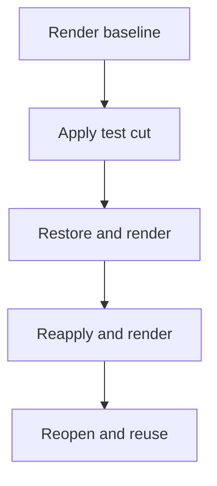

# Reproduce a reversible edit

TalkCut restores an edit by creating a new plan from preserved source material.
Prior plans and successful outputs stay available. This guide demonstrates that
round trip and explains what to do when an encode or project operation fails.

## Run the generated example

After `uv sync --locked`, run this from the repository root with a new or empty
destination:

```sh
uv run --locked python examples/recovery.py projects/recovery-example
```

The [example](../examples/recovery.py) creates a mathematical picture and tone,
then invokes the installed CLI in separate processes:



It preserves and inspects sources, compares complete frame/sample mappings and
checks identical encoded bytes after restoration and reapplication. It also
checks that an unchanged successful render is reused.

| File or directory in the destination | What to inspect |
| --- | --- |
| `result.json` | Round-trip result and references to the compared outputs |
| `executions.json` | Every command, exit code and elapsed time |
| `*.stdout.json`, `*.stderr.log` | Preserved command output and diagnostics |
| `project/` | Project revisions, preserved sources, immutable plans and successful renders |

A successful run reports `technical_roundtrip: PASS`, `test_only: true` and
`audiovisual_review: UNVERIFIED`. Semantic review and final readiness remain
outside this exercise's scope.

## Restore a cut in your project

Run these commands from the repository root. First reopen the project to get the
latest revision:

```sh
uv run --locked talkcut status PROJECT --json
```

Use the candidate's ID from the active plan and the current integer revision:

```sh
uv run --locked talkcut plan restore PROJECT \
  --candidate ID \
  --expected-revision REVISION \
  --json
```

Replace `PROJECT`, `ID` and `REVISION` with your values. Reopen the project before
making a second decision so an intervening change cannot be overwritten. Render
again and regenerate the required output QC, seam and whole-output reviews.
Prior decisions, sources, plans and successful outputs remain immutable artifacts.

Restoration changes the plan and clears its active render. Even when the restored
media matches an earlier output, the new plan still needs current evidence. See
[the revision model](architecture.md#revisions-retain-the-evidence-trail).

## Retry a failed render

A render interrupted with Ctrl-C retains its partial output, log and failure
manifest. Rerunning the same render command starts a new encode when no validated
success exists. A previous success is reused only when source hashes, timeline,
layout, renderer, toolchain and settings match. Never promote a partial file by
renaming it manually.

| Symptom | Next action |
| --- | --- |
| Interruption, timeout or FFmpeg command failure | Inspect the attempt's log and manifest, resolve the cause, then rerun the render command. |
| `ENOSPC` / insufficient disk space | Make space available outside preserved originals and successful outputs, then retry. |
| Source hash mismatch | Locate the registered original bytes. Replacing the expected hash is not recovery. |
| Revision conflict | Reopen with `status`, inspect the current plan and submit the decision against that revision. |
| Corrupt JSON or unsupported timing | Repair the input explicitly or supply supported media/timing; do not relabel the failure as success. |
| Changed review inputs or missing AI capability | Obtain fresh evidence or the required capability. Acceptance remains unverified until then. |

## Run the fault regressions

The generated fault regressions exercise actual FFmpeg interruption, timeout,
command failure and disk-full error injection at promotion:

```sh
uv run --locked pytest \
  tests/test_render_recovery.py \
  tests/test_source_adversarial.py \
  tests/test_plan_adversarial.py -q
```

The disk-full case injects an `ENOSPC` error; it does not fill the host disk. These
checks establish preservation and retry behavior. Missing audiovisual evidence
still prevents acceptance when every technical recovery test passes.
